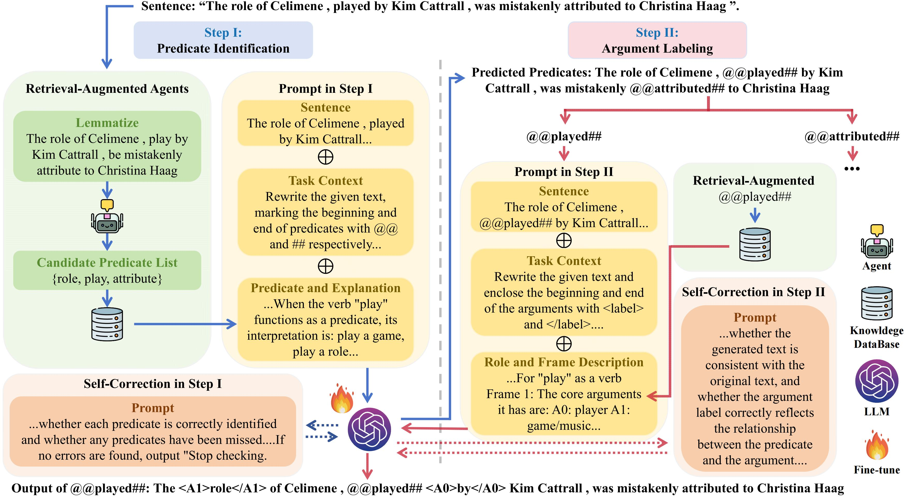

# LLM-SRL
This repository contains the code and prompt template for the ACL Findings 2025 paper "LLMs Can Also Do Well! Breaking Barriers in Semantic Role Labeling via Large Language Models", by Xinxin Li*, Huiyao Chen*, Chengjun Liu, Jing Li, Meishan Zhang†, Jun Yu, Min Zhang.

Please cite our paper if it is helpful to your work.

## Introduction
We propose a two-stage SRL framework using large language models (LLMs), consisting of predicate identification and argument labeling. To enhance LLM performance, we introduce two key mechanisms:

(1) Retrieval-Augmented Agent: We augment LLMs with external knowledge from predicate-argument descriptions to improve their understanding of predicate semantics.

(2) Self-Correction: We enable LLMs to evaluate and revise their own outputs to reduce hallucinations.

These mechanisms are integrated into a conversation-based architecture, where reasoning is iterative and LLMs adapt to the SRL task. This approach aligns with traditional BERT-style models while leveraging the strengths of LLMs in reasoning and flexibility.

